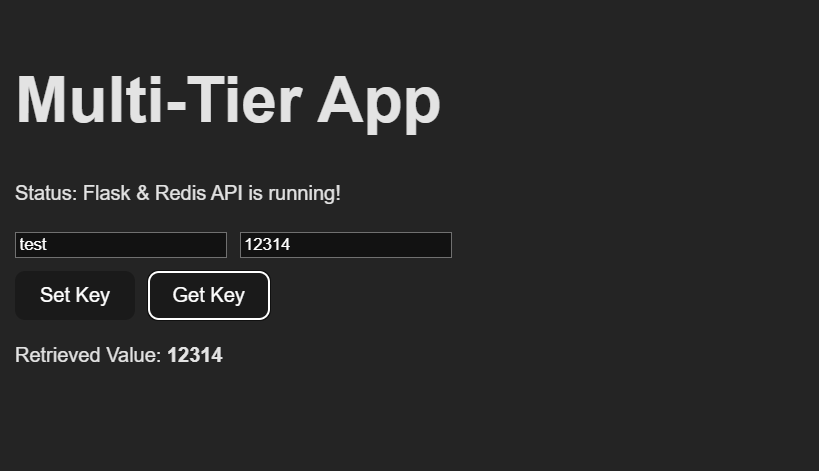

# Kubernetes (K8S) YAML Exercise: Multi-Tier Web Application Deployment on Minikube




## Structure


This exercise will guide you through deploying a multi-tier web application using Kubernetes (K8S) on Minikube. The application will include a Redis cache, a backend server, and a frontend server. You will learn to work with deployments, pods, replicas, namespaces, resource quotas, services, ConfigMaps, and Secrets.

## Prerequisites

- Minikube installed and running on your local machine
- Basic knowledge of Kubernetes and YAML syntax

## Exercise Overview

1. <u>Create a Namespace</u>
2. <u>Set a Resource Quota</u>
3. <u>Deploy a Redis Cache</u>
4. <u>Deploy a Backend Server</u>
5. <u>Deploy a Frontend Server</u>
6. <u>Configure Services (ClusterIP, NodePort, ExternalName)</u>
7. <u>Use ConfigMaps for Configuration</u>
8. <u>Use Secrets for Sensitive Data</u>

## Instructions

1. <u><b>Create a Namespace</b></u>

- Create a namespace called `multi-tier-app` to isolate the resources.

2. <u><b>Set a Resource Quota</b></u>

- Set a resource quota for the namespace to limit resource usage.

3. <u><b>Deploy a Redis Cache</b></u>

- Create a ConfigMap for Redis configuration.
- Create a ConfigMap for Redis configuration.
- Deploy Redis with the created ConfigMap.

4. <u><b>Deploy a Backend Server</b></u>

- Deploy the backend server with environment variables configured to connect to the Redis cache.
- Ensure the backend server has two replicas.

5. <u><b>Deploy a Frontend Server</b></u>

- Deploy the frontend server with environment variables configured to connect to the backend server.
- Ensure the frontend server has two replicas.

6. <u><b>Configure Services</b></u>

- Create a ClusterIP service for the Redis cache.
- Create a ClusterIP service for the backend server.
- Create a NodePort service for the frontend server.
- Create an ExternalName service to map an external DNS name.

7. <u><b>Use ConfigMaps for Configuration</b></u>

- Create a ConfigMap for the backend server configuration.

8. <u><b>Use Secrets for Sensitive Data</b></u>

- Create a Secret for storing sensitive information used by the backend server.

## Testing the Setup

Once everything is deployed, you can test the setup using `curl` commands.

1. <u>Check the Frontend Service:</u>

```sh
curl http://<minikube-ip>:30002
```

2. <u>Access the Backend Service from the Frontend Pod:</u>

```sh
kubectl exec -it <frontend-pod> -n multi-tier-app -- curl http://backend:8080
```

3. <u>Verify Cache Connection from the Backend Pod:</u>

```sh
kubectl exec -it <backend-pod> -n multi-tier-app -- curl http://redis:6379
```

## Submission

Please submit the following YAML files:

1. Namespace definition

- [namespace.yaml](./k8s_multi-tier_exercise/manifests/mta/multi-tier-app-namespace.yaml)

2. Resource Quota definition

- [namespace.yaml](./k8s_multi-tier_exercise/manifests/mta/multi-tier-app-resourcequota.yaml)

3. ConfigMap for Redis configuration

- [redis-configmap.yaml](./k8s_multi-tier_exercise/manifests/redis/redis-configmap.yaml)

4. Redis Deployment and Service

- [redis-deployment.yaml](./k8s_multi-tier_exercise/manifests/redis/redis-deployment.yaml)
- [redis-service.yaml](./k8s_multi-tier_exercise/manifests/redis/redis-service.yaml)

5. Backend Deployment and Service

- [backend-deployment.yaml](./k8s_multi-tier_exercise/manifests/backend/backend-deployment.yaml)
- [backend-service.yaml](./k8s_multi-tier_exercise/manifests/backend/backend-service.yaml)

6. Frontend Deployment and Service

- [frontend-deployment.yaml](./k8s_multi-tier_exercise/manifests/frontend/frontend-deployment.yaml)
- [frontend-service.yaml](./k8s_multi-tier_exercise/manifests/frontend/frontend-service.yaml)

7. ConfigMap for Backend configuration

- [backend-configmap.yaml](./k8s_multi-tier_exercise/manifests/backend/backend-configmap.yaml)
- [redis-configmap.yaml](./k8s_multi-tier_exercise/manifests/redis/redis-configmap.yaml)

8. Secret for sensitive information
9. ExternalName Service definition

- [external-name-service.yaml](./k8s_multi-tier_exercise/manifests/redis/redis-externalname.yaml)

**INIT SCRIPT** : The following script will apply all the resources in order, and run the minikube tunnel in the background.

- [run.sh](./k8s_multi-tier_exercise/scripts/run.sh)
