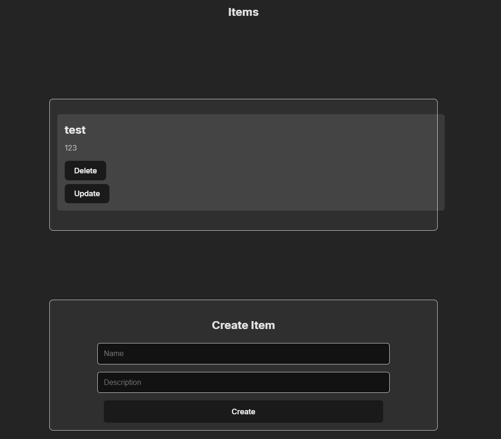

# Kubernetes (K8S) YAML Exercise: Secure and Scalable Web Application Deployment on Minikube

[back](../README.md)



This exercise will guide you through deploying a secure and scalable web application using Kubernetes (K8S) on Minikube. The application will include a MongoDB database, a backend server, and a frontend server. You will also learn to work with RBAC permissions in namespaces, perform health checks, and manage replicas.

## Prerequisites

- Minikube installed and running on your local machine
- Basic knowledge of Kubernetes and YAML syntax
  Exercise Overview

## Exercise

1. <u>Create a Namespace</u>
2. <u>Set a Resource Quota</u>
3. <u>Set Up RBAC Permissions</u>
4. <u>Deploy a MongoDB Database</u>
5. <u>Deploy a Backend Server</u>
6. <u>Deploy a Frontend Server</u>
7. <u>Configure Services (ClusterIP, NodePort, ExternalName)</u>
8. <u>Use ConfigMaps for Configuration</u>
9. <u>Use Secrets for Sensitive Data</u>
10. <u>Perform Health Checks on Replicas</u>

## Instructions

1. <u><b>Create a Namespace:</b></u>

- Create a namespace called `secure-app` to isolate the resources.

2. <u><b>Set a Resource Quota:</b></u>

- Set a resource quota for the namespace to limit resource usage.

3. <u><b>Set Up RBAC Permissions:</b></u>

- Create Role and RoleBinding to manage permissions within the namespace.
- Create a Role that grants permissions to manage pods and services.
- Create a RoleBinding that assigns the Role to a specific user.

4. <u><b>Deploy a MongoDB Database:</b></u>

- Create a Secret for the MongoDB credentials and a ConfigMap for database configuration.
- Create a Secret for MongoDB credentials.
- Create a ConfigMap for MongoDB configuration.
- Deploy MongoDB with the created Secret and ConfigMap.

5. <u><b>Deploy a Backend Server:</b></u>

- Deploy the backend server with environment variables configured to connect to the MongoDB database.
- Ensure the backend server has three replicas.
- Include readiness and liveness probes for health checks.

6. <u><b>Deploy a Frontend Server:</b></u>

- Deploy the frontend server with environment variables configured to connect to the backend server.
- Ensure the frontend server has three replicas.
- Include readiness and liveness probes for health checks.

7. <u><b>Configure Services:</b></u>

- Create a ClusterIP service for the MongoDB database.
- Create a ClusterIP service for the backend server.
- Create a NodePort service for the frontend server.
- Create an ExternalName service to map an external DNS name.

8. <u><b>Use ConfigMaps for Configuration:</b></u>

- Create a ConfigMap for the backend server configuration.

9. <u><b>Use Secrets for Sensitive Data:</b></u>

- Create a Secret for storing API keys used by the backend server.

10. <u><b>Perform Health Checks on Replicas:</b></u>

- Add liveness and readiness probes to the backend and frontend deployments to perform health checks.

## Testing the Setup

Once everything is deployed, you can test the setup using `curl` commands.

1. <u><b>Check the Frontend Service:</b></u>

```sh
curl http://<minikube-ip>:30003
```

2. <u><b>Access the Backend Service from the Frontend Pod:</b></u>

```sh
kubectl exec -it <frontend-pod> -n secure-app -- curl http://backend:8080
```

3. <u><b>Verify Database Connection from the Backend Pod:</b></u>

```sh
kubectl exec -it <backend-pod> -n secure-app -- curl http://mongodb:27017
```

## Submission

Please submit the following YAML files:

1. Namespace definition

- [secure-app-namespace.yaml](./k8_secure_scalable_exercise/manifests/ns/secure-app-namespace.yaml)

2. Resource Quota definition

- [secure-app-resourcequota](./k8_secure_scalable_exercise/manifests/ns/secure-app-resourcequota.yaml)

3. Role and RoleBinding definitions

- [secure-app-role.yaml](./k8_secure_scalable_exercise/manifests/ns/secure-app-role.yaml)
- [secure-app-rolebinding.yaml](./k8_secure_scalable_exercise/manifests/ns/secure-app-rolebinding.yaml)

4. Secret for MongoDB credentials

- [mongo-secret.yaml](./k8_secure_scalable_exercise/manifests/mongo/mongo-secret.yaml)

5. ConfigMap for MongoDB configuration

- [mongo-configmap.yaml](./k8_secure_scalable_exercise/manifests/mongo/mongo-configmap.yaml)

6. MongoDB Deployment and Service

- [mongo-deployment.yaml](./k8_secure_scalable_exercise/manifests/mongo/mongo-deployment.yaml)

7. Backend Deployment and Service with health checks

- [backend-deployment.yaml](./k8_secure_scalable_exercise/manifests/backend/backend-deployment.yaml)
- [backend-service.yaml](./k8_secure_scalable_exercise/manifests/backend/backend-service.yaml)

8. Frontend Deployment and Service with health checks

- [frontend-deployment.yaml](./k8_secure_scalable_exercise/manifests/frontend/frontend-deployment.yaml)
- [frontend-service.yaml](./k8_secure_scalable_exercise/manifests/frontend/frontend-service.yaml)

9. ConfigMap for Backend configuration

- [backend-configmap.yaml](./k8_secure_scalable_exercise/manifests/backend/backend-configmap.yaml)

10. Secret for API keys
11. ExternalName Service definition

**INIT SCRIPT** : The following script will apply all the resources in order, and run the minikube tunnel in the background.

- [run.sh](./k8_secure_scalable_exercise/scripts/run.sh)
