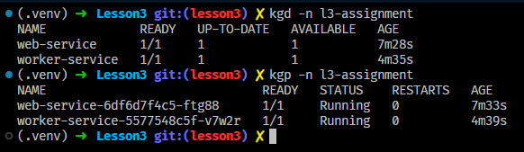

# Exercise: Deploying a Multi-Service Flask Application on Minikube

- [back](../README.md)

## Overview

You will create and deploy a multi-service Flask application using Docker, Kubernetes, and AWS ECR.
The application consists of:

1. `web-service` (Flask API) - Receives user input and forwards it to a worker service for processing.
2. `worker-service` (Flask API) - Processes the input received from `web-service` and returns a response.

The `web-service` and `worker-service` will communicate internally within Minikube using Kubernetes DNS.
The `web-service` should be exposed to the outside world, while the `worker-service` should only be accessible from within the cluster.

Additionally, you will:

- Deploy the services on Minikube using Kubernetes Deployments and Services.
- Use ClusterIP for internal communication and NodePort for external access.
- Push your Docker images to AWS ECR.
- Scan your images using Trivy and provide a short security analysis.

## Application Details

1. `web-service` (Flask API)

- The `web-service` exposes an HTTP endpoint (`/analyze`).
- It accepts a JSON payload containing a text string.
- It forwards the text to `worker-service` for processing.
- It waits for a response and returns the processed text to the user.

Example API request to `web-service`:

```json
{
  "text": "Hello, how are you?"
}
```

Example API response from `web-service`:

```json
{
  "processed_text": "Word Count: 4 | Reverse: ?uoy era woh ,olleH"
}
```

2. `worker-service` (Flask API)

- The `worker-service` exposes an internal API endpoint (`/process`).
- It accepts text from `web-service` and applies two transformations:
  1. Word count - Counts the number of words in the text.
  2. Reverse text - Reverses the entire text.
- It returns the processed result to `web-service`.

Example API request to `worker-service`:

```json
{
  "text": "Hello, how are you?"
}
```

Example API response from `worker-service`:

```json
{
  "word_count": 4,
  "reversed_text": "?uoy era woh ,olleH"
}
```

## Deployment Architecture

### Kubernetes Components

- A Namespace for the application.
- Two Deployments (`web-service` and `worker-service`).
- Two Services:
  - ClusterIP for `worker-service` (internal communication).
  - NodePort for `web-service` (external access).
- DNS-based Service Discovery to allow `web-service` to reach `worker-service`.

### Flow of Communication

1. A user sends a request to the NodePort service (`web-service`).
2. `web-service` forwards the request to the ClusterIP service (`worker-service`).
3. `worker-service` processes the request and responds.
4. `web-service` sends the processed response back to the user.

### Tasks

1. Build the Flask Applications

- Implement `web-service` and `worker-service` according to the details above.
- [web-service](./web_service/main.py)
- [worker-service](./worker_service/main.py)

2. Containerization

- Create a Dockerfile for each service. Ensure efficient image size (avoid unnecessary dependencies).
- [web-service-Dockerfile](./web_service/Dockerfile)
- [worker-service-Dockerfile](./worker_service/Dockerfile)

3. Push Images to AWS ECR

- Tag and push both images to AWS ECR. Ensure Kubernetes can pull images from ECR.
  

4. Deploy to Minikube

- Create a Namespace.
- [namespace.yaml](./manifests/global/l3-assignment-namespace.yaml)
- 
- Deploy both services using Kubernetes Deployments.
- [web-service-deployment.yaml](./manifests/web-service/web-service-deployment.yaml)
- [worker-service-deployment.yaml](./manifests/worker-service/worker-service-deployment.yaml)
- Set up a ClusterIP service for `worker-service`.
- [worker-service-service.yaml](./manifests/worker-service/worker-service-service.yaml)
- Set up a NodePort service for `web-service`.
- [web-service-service.yaml](./manifests/web-service/web-service-service.yaml)
- 
- Ensure that `web-service` correctly resolves the DNS name of `worker-service`.

- 

5. Security Scan

- Use Trivy to scan your Docker images.
- Write a short security report on any vulnerabilities found.

### Deliverables

- Flask application code (`web-service` & `worker-service`).
- Dockerfiles.
- Kubernetes YAML manifests (Deployments, Services, Namespace).
- ECR image repository URLs.
- Trivy security report.

### Bonus Challenge

Modify `worker-service` to be asynchronous, processing requests using Celery and Redis.
