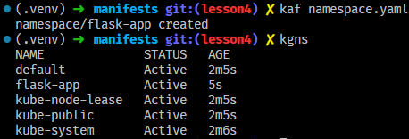
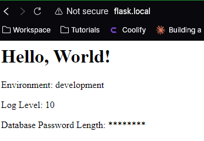
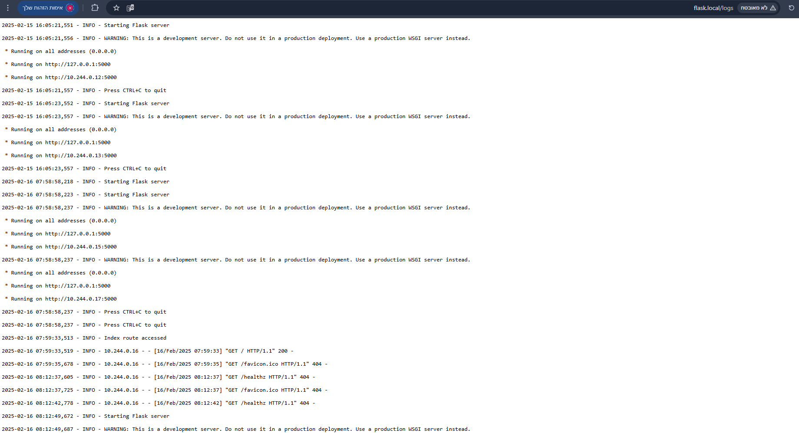

# Exercise: Deploy a Flask Application on Minikube

- [back](../README.md)

## Objective:

Deploy a Flask application on a local Minikube cluster while implementing Namespaces, Services, ConfigMaps, Secrets, DNS, Ingress, Volumes, StatefulSets, DaemonSets, and CronJobs.

## Prerequisites:

1. Minikube installed and running (`minikube start`)
2. kubectl installed
3. Basic knowledge of Kubernetes objects
4. Docker installed (to build the Flask image if necessary)
   - Step 1: Create a Namespace
     Define a new namespace called `flask-app` to isolate the application. Apply and verify it using `kubectl get namespaces`.
     - [namespace.yaml](./manifests/namespace.yaml)
     - 
   - Step 2: Create a ConfigMap
     Create a ConfigMap named `flask-config` to store environment variables such as `APP_ENV=development` and `LOG_LEVEL=debug`. Use it in your Flask application.
     - [configmap.yaml](./manifests/configmap.yaml)
     - 
   - Step 3: Create a Secret
     Create a Secret named `flask-secret` to store sensitive data like `DB_PASSWORD`. Ensure the value is base64-encoded. Use it in your Flask application for secure credentials.
     - [secret.yaml](./manifests/secret.yaml)
     - 
   - Step 4: Deploy the Flask Application
     Create a Deployment for the Flask app with at least two replicas. Ensure it uses the ConfigMap and Secret, and exposes port 5000.
     - [deployment.yaml](./manifests/deployment.yaml)
     - 
   - Step 5: Create a Service
     Define a ClusterIP Service named `flask-service` that routes traffic from port 80 to port 5000 of the Flask application.
     - [service.yaml](./manifests/service.yaml)
     - 
   - Step 6: Configure Ingress
     Create an Ingress rule for `flask.local` that routes external traffic to the Flask service. Enable the Minikube Ingress addon and verify it works.
     - [flask-ingress.yaml](./manifests/flask-ingress.yaml)
     - 
     - 
   - Step 7: Configure Persistent Volume
     Create a PersistentVolume (PV) and PersistentVolumeClaim (PVC) for storing logs or data. Ensure your Deployment mounts this volume.
     - [pv.yaml](./manifests/pv.yaml)
     - [pvc.yaml](./manifests/pvc.yaml)
     - 
   - Step 8: Deploy a StatefulSet
     Convert the Deployment to a StatefulSet. It should maintain a stable network identity for each pod and attach a PersistentVolumeClaim per replica.
     - [statefulset.yaml](./manifests/statefulset.yaml)
     - 
   - Step 9: Deploy a DaemonSet
     Create a DaemonSet that runs a logging sidecar on every node, mounting the persistent volume.
   - Step 10: Create a CronJob
     Define a CronJob that executes every 5 minutes, making an HTTP request to the Flask service to check its health.
     - [cron.yaml](./manifests/cron.yaml)
     - 

## Testing & Validation

     Verify the setup by checking:

1. If the Flask app responds via Ingress at `http://flask.local`.
2. If PersistentVolume is correctly mounted and retains data.
3. If the StatefulSet retains Pod identities.
4. If the DaemonSet runs on every node.
5. If the CronJob executes every 5 minutes.
   Final Validation Commands:

```bash
kubectl get all -n flask-app
kubectl logs <flask-pod-name> -n flask-app
kubectl get pvc -n flask-app
```
