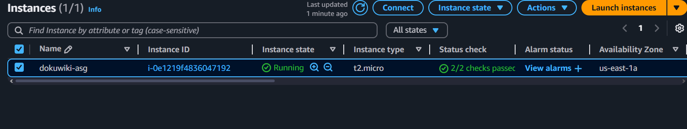
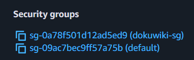
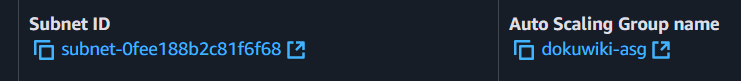

# Terraform exercise

- [back](../README.md)

## Define in terraform the following resources:

1. Security group with ingress rule allowing communication from anywhere on port 80 named: dokuwiki-sg
2. AWS instance with the following attributes:

   - a ) based on amazon linux AMI
   - b ) t2.micro size
   - c ) The following user data:

   ```bash
   #!/usr/bin/bash
    yum install docker -y
    systemctl enable docker
    systemctl start docker
    docker run -d -p 80:80 --name dokuwiki bitnami/dokuwiki:latest
   ```

   - d ) Security groups: default and dokuwiki

3. Define the previous EC2 instance as an autoscaling group with 1 instance

## BONUS:

1. Define the following resources with terraform:
   - a ) Define a new VPC with 2 subnets on us-east-1 region
   - b ) Define the project above in the VPC you just created

### Solution

- [solution](./terraform-exercise/main.tf)
  
  
  

### Answers

under this [repo](https://github.com/avieadvanced-devops/blob/master/exercises/7)
